# Auth0 Authentication Flow Analysis
## Multiple Authentication Methods

This document provides a comprehensive analysis of Auth0 authentication workflows, including:
- **Database Authentication**: User `jim.oxy@oxy.com` (from `log_back_in_jim.har`)
- **Social Authentication**: User `cjsy2002@gmail.com` via Google OAuth (from `log_back_in_google.har`)
- **Enterprise Connection**: Expected workflow for `@p2es.com` domain users

## Table of Contents
1. [Authentication Flow Overview](#authentication-flow-overview)
2. [Database Authentication - jim.oxy@oxy.com](#database-authentication---jimoxyoxycom)
3. [Google OAuth Authentication - cjsy2002@gmail.com](#google-oauth-authentication---cjsy2002gmailcom)
4. [Enterprise Connection Workflow](#enterprise-connection-workflow)
5. [B2B Guest Authentication with Admin Consent](#b2b-guest-authentication-with-admin-consent)
6. [Multi-Tenant Support](#multi-tenant-support)
7. [Key Insights](#key-insights)
8. [Configuration Analysis](#configuration-analysis)

---

## Authentication Flow Overview

Auth0 supports multiple authentication methods that are selected based on user email domain and available connections. The authentication process follows the OAuth 2.0 Authorization Code flow with PKCE (Proof Key for Code Exchange) for enhanced security.

### Connection Selection Logic

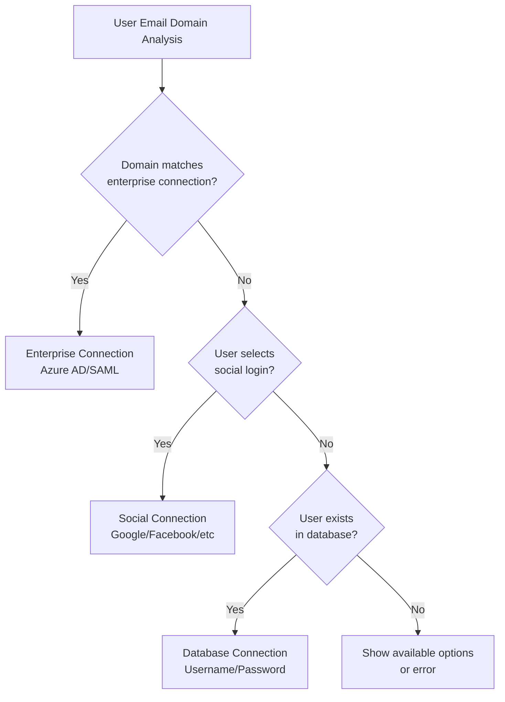

### OAuth 2.0 Authorization Code Flow with PKCE

The complete authentication flow involves three critical phases:

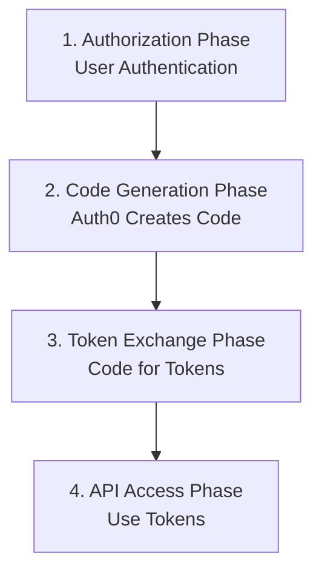

### Authorization Code Generation and Exchange

#### What is the Authorization Code?

The authorization code is a **secure, one-time-use reference key** that Auth0 generates after successful authentication. It's NOT encrypted user data, but rather a random string that references server-side stored authentication context.

#### Authorization Code Flow Sequence

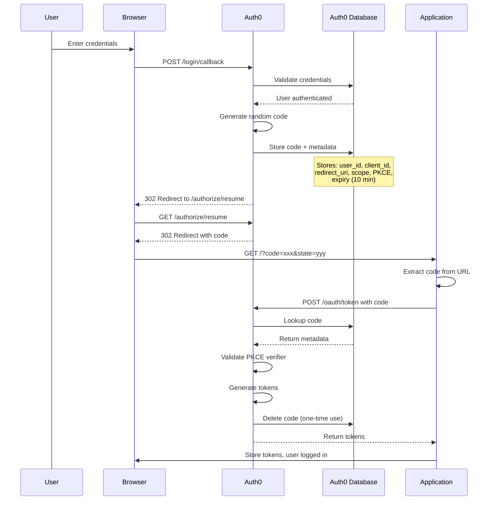

#### Authorization Code Storage

When Auth0 generates an authorization code, it stores this metadata server-side:

```javascript
// The code sent to client (just a random reference)
authorization_code = "Cq8Q5v8V3PYL6IQe5sYB0U8tG3HCFjXkFgUn"

// What Auth0 stores internally (linked to code)
stored_metadata = {
  user_id: "auth0|5c892c1cebea722b368665bf",
  client_id: "wMJIjHdpGq4mchWPr9R6I9bHxHiCT0tB",
  redirect_uri: "http://localhost:4200",
  scope: "openid profile email",
  audience: "https://p2apis.p2devops.com",
  code_challenge: "fO_Qg94afpiArfGt5mTuJNN2yJkuEhhvfssjPWNopxA",
  code_challenge_method: "S256",
  connection: "P2DevOpsUsers",
  auth_time: "2025-09-03T15:31:50.000Z",
  expires_at: "2025-09-03T15:41:50.000Z", // 10 minute expiry
  session_id: "sWm4OzNgS1Ee9GmWUEXclLrj7bCbtL7t"
}
```

### Token Exchange Process

#### The `/oauth/token` Endpoint

The token exchange happens when the application sends the authorization code to Auth0:

```javascript
// Request
POST https://p2es-iam-dev.auth0.com/oauth/token
{
  "client_id": "wMJIjHdpGq4mchWPr9R6I9bHxHiCT0tB",
  "grant_type": "authorization_code",
  "code": "Cq8Q5v8V3PYL6IQe5sYB0U8tG3HCFjXkFgUn",
  "code_verifier": "dBjftJeZ4CVP-mB92K27uhbUJU1p1r_wW1gFWFOEjXk",
  "redirect_uri": "http://localhost:4200"
}

// Response
{
  "access_token": "eyJhbGciOiJSUzI1NiIsInR5cCI6IkpXVCIs...",
  "id_token": "eyJhbGciOiJSUzI1NiIsInR5cCI6IkpXVCIs...",
  "token_type": "Bearer",
  "expires_in": 86400,
  "scope": "openid profile email"
}
```

#### Auth0's Token Validation Process

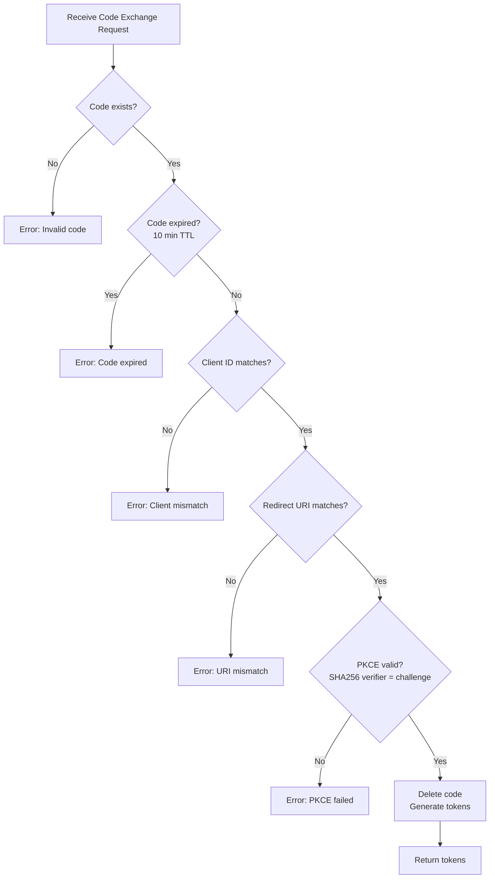

### Token Structure and Usage

#### ID Token (User Identity)
Contains user profile information for the frontend:

```json
{
  "iss": "https://p2es-iam-dev.auth0.com/",
  "sub": "auth0|5c892c1cebea722b368665bf",
  "email": "jim.oxy@oxy.com",
  "name": "jim.oxy@oxy.com",
  "picture": "https://s.gravatar.com/avatar/...",
  // Custom P2 claims from Auth0 Action
  "https://p2es.com/org": "p2es",
  "https://p2es.com/active": "true",
  "https://p2es.com/grps": "afe-std-test reporting-std-test"
}
```

#### Access Token (API Authorization)
Contains permissions for backend API access:

```json
{
  "iss": "https://p2es-iam-dev.auth0.com/",
  "sub": "auth0|5c892c1cebea722b368665bf",
  "aud": ["https://p2apis.p2devops.com"],
  "scope": "openid profile email",
  // Same custom claims for API authorization
  "https://p2es.com/org": "p2es",
  "https://p2es.com/grps": "afe-std-test reporting-std-test"
}
```

### How Applications Use Tokens

#### Frontend Token Management (Angular)

```javascript
// Auth0 SDK handles token storage automatically
this.auth.getAccessTokenSilently().subscribe(token => {
  // Token ready for API calls
});

// HTTP Interceptor adds token to API requests
@Injectable()
export class AuthInterceptor implements HttpInterceptor {
  intercept(req: HttpRequest<any>, next: HttpHandler) {
    return this.auth.getAccessTokenSilently().pipe(
      mergeMap(token => {
        const authReq = req.clone({
          headers: req.headers.set('Authorization', `Bearer ${token}`)
        });
        return next.handle(authReq);
      })
    );
  }
}
```

#### Backend Token Validation (.NET)

```csharp
// API validates incoming Bearer tokens
[Authorize]
public class UsersController : ControllerBase {
    [HttpGet("profile")]
    public IActionResult GetProfile() {
        // JWT middleware validates signature
        var org = User.FindFirst("https://p2es.com/org")?.Value;
        var groups = User.FindFirst("https://p2es.com/grps")?.Value;
        
        // Authorization based on claims
        if (groups?.Contains("reporting-std-test") == true) {
            return Ok(GetUserProfile());
        }
        return Forbid();
    }
}
```

### Security Features

1. **PKCE Protection**: Prevents authorization code interception attacks
2. **One-Time Code**: Authorization codes can only be used once
3. **Short-Lived Codes**: 10-minute expiration for authorization codes
4. **Token Validation**: Backend validates JWT signature using Auth0's public key
5. **Audience Verification**: Ensures tokens are intended for your API
6. **Secure Storage**: Auth0 SDK manages token storage securely

---

## Database Authentication - jim.oxy@oxy.com

### Flow Diagram

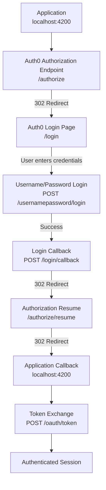

### Step 1: Initial Authorization Request
**Time:** 15:31:41  
**Endpoint:** `GET https://p2es-iam-dev.auth0.com/authorize`  
**Status:** 302 (Redirect)

#### Request Parameters
```json
{
  "client_id": "wMJIjHdpGq4mchWPr9R6I9bHxHiCT0tB",
  "scope": "openid profile email",
  "audience": "https://p2apis.p2devops.com",
  "redirect_uri": "http://localhost:4200",
  "response_type": "code",
  "response_mode": "query",
  "state": "TXBreWs3NVhWeVNOM0NERU5XZGc1NWtKTU1MdlJpc3YwUGJoM2VHVzBTUw==",
  "nonce": "ZEd4ajNpT1BJazNkV3ZhR0dEZmNnZGl2NTBTb2g5VzQxZElNTEZqUERzZA==",
  "code_challenge": "fO_Qg94afpiArfGt5mTuJNN2yJkuEhhvfssjPWNopxA",
  "code_challenge_method": "S256",
  "auth0Client": {
    "name": "@auth0/auth0-angular",
    "version": "2.1.0",
    "env": {
      "angular/core": "17.0.1"
    }
  }
}
```

#### Response
- Redirects to Auth0 login page with session state

---

### Step 2: Auth0 Login Page Load
**Time:** 15:31:41  
**Endpoint:** `GET https://p2es-iam-dev.auth0.com/login`  
**Status:** 200 (OK)

#### Associated Resources Loaded
- Auth0 Lock.js library: `https://cdn.auth0.com/js/lock/11.14/lock.min.js`
- Client configuration: `/client/wMJIjHdpGq4mchWPr9R6I9bHxHiCT0tB.js`

The login page presents available authentication options to the user.

---

### Step 3: Username/Password Authentication
**Time:** 15:31:50  
**Endpoint:** `POST https://p2es-iam-dev.auth0.com/usernamepassword/login`  
**Status:** 200 (OK)

#### Request Body
```json
{
  "client_id": "wMJIjHdpGq4mchWPr9R6I9bHxHiCT0tB",
  "redirect_uri": "http://localhost:4200",
  "tenant": "p2es-iam-dev",
  "response_type": "code",
  "scope": "openid profile email",
  "state": "hKFo2SBkQ3FjN3FHV1FXZlFvZW9hQXhLNklVQVFnUUhvTk5oaqFupWxvZ2lu...",
  "nonce": "ZEd4ajNpT1BJazNkV3ZhR0dEZmNnZGl2NTBTb2g5VzQxZElNTEZqUERzZA==",
  "connection": "P2DevOpsUsers",
  "username": "jim.oxy@oxy.com",
  "password": "[REDACTED]",
  "sso": true,
  "response_mode": "query",
  "audience": "https://p2apis.p2devops.com",
  "code_challenge_method": "S256",
  "code_challenge": "fO_Qg94afpiArfGt5mTuJNN2yJkuEhhvfssjPWNopxA",
  "protocol": "oauth2"
}
```

#### Key Finding
- **Connection Used:** `P2DevOpsUsers` (Database Connection)
- **NOT** using the enterprise connection `amccullochp2es-waad`

---

### Step 4: Callback Processing
**Time:** 15:31:50  
**Endpoint:** `POST https://p2es-iam-dev.auth0.com/login/callback`  
**Status:** 302 (Redirect)

The successful authentication triggers a callback to complete the authorization flow.

#### Redirect Chain
1. `POST /login/callback` → 302
2. `GET /authorize/resume?state=sWm4OzNgS1Ee9GmWUEXclLrj7bCbtL7t` → 302
3. Returns to application with authorization code

---

### Step 5: Token Exchange
**Time:** 15:31:52  
**Endpoint:** `POST https://p2es-iam-dev.auth0.com/oauth/token`  
**Status:** 200 (OK)

#### Request Body (PKCE Flow)
```json
{
  "client_id": "wMJIjHdpGq4mchWPr9R6I9bHxHiCT0tB",
  "grant_type": "authorization_code",
  "code": "[AUTHORIZATION_CODE]",
  "code_verifier": "[PKCE_VERIFIER]",
  "redirect_uri": "http://localhost:4200"
}
```

#### Response Contains
- Access Token
- ID Token
- Refresh Token (if configured)
- Token expiration information

---

### Step 6: User Profile (from ID Token)
The ID token contains the following user profile information:

```json
{
  "https://p2es.com/org": "p2es",
  "https://p2es.com/active": "true",
  "https://p2es.com/grps": "afe-std-test reporting-std-test reporting-prm-prm",
  "given_name": "Jim",
  "family_name": "Oxy",
  "nickname": "jim.oxy",
  "name": "jim.oxy@oxy.com",
  "picture": "https://s.gravatar.com/avatar/8f7ac47598e992b9a44fbd5e7066556f?s=480&r=pg&d=https%3A%2F%2Fcdn.auth0.com%2Favatars%2Fji.png",
  "updated_at": "2025-09-03T17:45:50.783Z",
  "email": "jim.oxy@oxy.com",
  "email_verified": true,
  "sub": "auth0|5c892c1cebea722b368665bf"
}
```

---

## Google OAuth Authentication - cjsy2002@gmail.com

### Flow Diagram

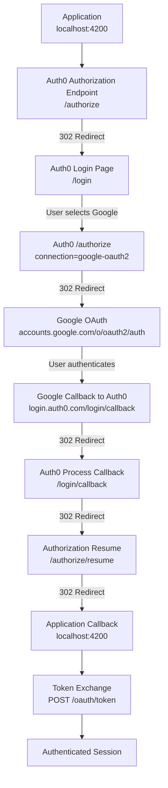

### Step 1: Initial Authorization Request
**Time:** 15:32:53  
**Endpoint:** `GET https://p2es-iam-dev.auth0.com/authorize`  
**Status:** 302 (Redirect)

Same initial flow as database authentication, redirects to Auth0 login page.

### Step 2: User Selects Google Login
**Time:** 15:32:57  
**Endpoint:** `GET https://p2es-iam-dev.auth0.com/authorize`  
**Status:** 302 (Redirect)

#### Key Parameters
```json
{
  "connection": "google-oauth2",
  "client_id": "wMJIjHdpGq4mchWPr9R6I9bHxHiCT0tB",
  "scope": "openid profile email",
  "audience": "https://p2apis.p2devops.com",
  "redirect_uri": "http://localhost:4200",
  "response_type": "code",
  "code_challenge": "F8UAWTglTZi57ibkx87RiZY9Vfpxmx3sin3hgyfHHOc",
  "code_challenge_method": "S256"
}
```

### Step 3: Redirect to Google OAuth
**Time:** 15:32:57  
**Endpoint:** `GET https://accounts.google.com/o/oauth2/auth`  
**Status:** 302 (Redirect)

#### Google OAuth Parameters
```json
{
  "response_type": "code",
  "redirect_uri": "https://login.auth0.com/login/callback",
  "scope": "email profile",
  "client_id": "870216976608-q7pjgck3d643hi35crp0u49p3gtph36a.apps.googleusercontent.com",
  "state": "Fe26.2**[encrypted_state]"
}
```

**Note:** Auth0 uses its own Google OAuth client ID to authenticate with Google.

### Step 4: Google Authentication Callback
**Time:** 15:32:58  
**Endpoint:** `GET https://login.auth0.com/login/callback`  
**Status:** 302 (Redirect)

Google returns authorization code to Auth0's callback URL with:
- Authorization code from Google
- State parameter for security
- Scope confirmation

### Step 5: Auth0 Process Google Response
**Time:** 15:32:58  
**Endpoint:** `GET https://p2es-iam-dev.auth0.com/login/callback`  
**Status:** 302 (Redirect)

Auth0 processes the Google authentication and continues the flow.

### Step 6: Token Exchange
**Time:** 15:33:00  
**Endpoint:** `POST https://p2es-iam-dev.auth0.com/oauth/token`  
**Status:** 200 (OK)

Same PKCE token exchange as database authentication.

### Step 7: User Profile (from ID Token)
The ID token for Google authenticated user contains:

```json
{
  "given_name": "Jerry",
  "family_name": "Chen",
  "nickname": "cjsy2002",
  "name": "Jerry Chen",
  "picture": "https://lh3.googleusercontent.com/a/ACg8ocLCyc-uNbs0iQYQVHZW7ggtIdnVtsR3WTP5Nm29O7_aFaHrcbQW=s96-c",
  "updated_at": "2025-09-03T19:56:23.515Z",
  "email": "cjsy2002@gmail.com",
  "email_verified": true,
  "sub": "google-oauth2|100215936904259774771"
}
```

#### Key Differences from Database User:
- **Subject Format:** `google-oauth2|[google_user_id]` instead of `auth0|[user_id]`
- **No Custom Claims:** Missing P2 organization claims (`https://p2es.com/*`)
- **Picture Source:** Google profile picture instead of Gravatar
- **User would need claims added** via Auth0 Rules/Actions to access P2 resources

---

## Enterprise Connection Workflow

### Actual Implementation - Domain Detection and Admin Consent

Based on the analysis of `jxc0116@p2es.com` login attempt (`log_back_in_p2es_ad_admin_approval.har`), here's how the enterprise connection actually works:

#### Actual Flow with Admin Consent Error

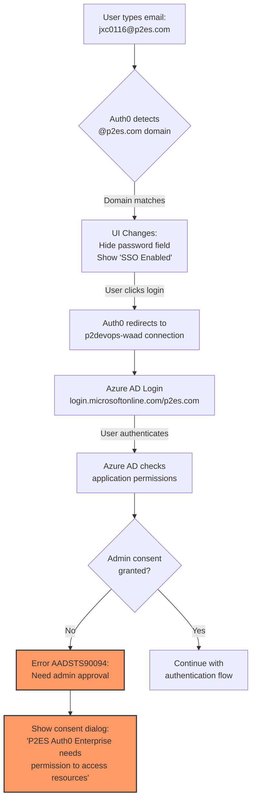

#### Why Password Field Disappears ("Single Sign-On Enabled")

When you type an email with `@p2es.com` domain, Auth0's JavaScript client detects the domain in real-time and:

1. **Domain Detection Trigger**: As soon as `@p2es.com` is entered, Auth0 checks configured enterprise connections
2. **UI Transformation**: Password field is hidden and replaced with "Single Sign-On Enabled" message
3. **Automatic Routing**: Login button now redirects to Azure AD instead of Auth0's database authentication

This happens because:
- Auth0 has `p2devops-waad` enterprise connection configured for `p2es.com` domain
- The connection uses Azure AD with client ID `1f5da299-8302-4ea8-b88a-2e6e85011ef0`
- Domain detection is performed client-side for immediate UX feedback

**Technical Implementation:**
```javascript
// Auth0 Lock.js performs real-time domain checking
emailInput.addEventListener('input', (e) => {
  const email = e.target.value;
  const domain = email.split('@')[1];
  
  // Check if domain matches enterprise connections
  if (domain === 'p2es.com') {
    // Hide password field
    passwordField.style.display = 'none';
    // Show SSO indicator
    ssoIndicator.textContent = 'SINGLE SIGN-ON ENABLED';
    // Change login button behavior
    loginButton.onclick = () => redirectToEnterpriseConnection('p2devops-waad');
  }
});
```

#### Admin Consent Requirement

The "Need admin approval" dialog appears because:

1. **Azure AD Application Permissions**: The Auth0 enterprise application requests these Microsoft Graph API permissions:
   - `openid profile email` (basic profile)
   - `https://graph.microsoft.com/User.Read` (read user profile)
   - `https://graph.microsoft.com/Directory.Read.All` (read directory data - **requires admin consent**)

2. **Error Code**: `AADSTS90094` - "An administrator of P2ES Holdings, Inc has set a policy that prevents you from granting P2ES Auth0 Enterprise the permissions it is requesting"

3. **Resolution Required**: An Azure AD administrator must:
   - Grant consent for the Auth0 application in Azure portal
   - Or reduce requested permissions to user-level only

### Expected vs Actual Workflow Comparison

| Aspect | Expected | Actual |
|--------|----------|--------|
| Domain Detection | Server-side after form submission | Client-side real-time as user types |
| UI Change | After clicking login | Immediate when domain detected |
| Connection | `018aa8a55-bbab-4a2e-9fa1e-2ef4e7f04f1dd` | `1f5da299-8302-4ea8-b88a-2e6e85011ef0` |
| Permissions | Basic profile only | Includes Directory.Read.All (admin consent required) |
| User Experience | Seamless SSO | Blocked by admin consent requirement |

### Azure AD Tenant Resolution and Configuration

#### How Auth0 Determines the Azure AD Tenant

Auth0 determines which Azure AD tenant to authenticate against through multiple configuration points, not just the client ID:

##### 1. Tenant Resolution Methods

Auth0 can resolve the tenant using three different approaches:

```javascript
// Method 1: Domain-based (current P2ES configuration)
// Uses the verified domain name
https://login.microsoftonline.com/p2es.com/oauth2/v2.0/authorize

// Method 2: Tenant ID-based
// Uses the Azure AD tenant GUID
https://login.microsoftonline.com/{tenant-id}/oauth2/v2.0/authorize

// Method 3: Common endpoint
// For multi-tenant applications
https://login.microsoftonline.com/common/oauth2/v2.0/authorize
```

##### 2. Configuration Flow

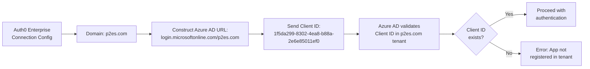

##### 3. Why the Client ID Works

The client ID (`1f5da299-8302-4ea8-b88a-2e6e85011ef0`) is an application registration in the P2ES Azure AD tenant. The relationship works because:

1. **App Registration**: The Auth0 application is registered in the p2es.com Azure AD tenant
2. **Domain Configuration**: Auth0's enterprise connection specifies `p2es.com` as the domain
3. **URL Construction**: Auth0 builds the authorization URL using the domain: `https://login.microsoftonline.com/p2es.com/`
4. **Validation**: Azure AD validates that the client ID exists in the p2es.com tenant

#### Azure Portal - Finding Domain and Admin Status

##### Locating Your Azure AD Domain

1. **Primary Domain Location**
   ```
   Azure Portal → Azure Active Directory → Overview
   ├── Primary domain: p2es.com (or p2es.onmicrosoft.com)
   ├── Tenant ID: [GUID]
   └── Directory ID: [same as Tenant ID]
   ```

2. **Custom Domains Management**
   ```
   Azure Portal → Azure Active Directory → Custom domain names
   ├── p2es.com (verified, primary) ✓
   ├── p2es.onmicrosoft.com (default)
   └── [Other verified domains]
   ```

3. **Tenant Properties**
   ```
   Azure Portal → Azure Active Directory → Properties
   ├── Name: P2ES Holdings, Inc
   ├── Tenant ID: [GUID]
   ├── Primary domain: p2es.com
   └── Country/Region: [Location]
   ```

##### Checking Administrator Status

1. **Quick Admin Check**
   ```
   Azure Portal → Top right corner → Your account
   └── Directory role: [Your role - e.g., "Global Administrator"]
   ```

2. **Detailed Role Check**
   ```
   Azure Portal → Azure Active Directory → Roles and administrators
   → Search for your username (jxc0116@p2es.com)
   → View assigned roles
   ```

3. **Roles That Can Grant Admin Consent**
   - **Global Administrator**: Full access to grant any consent
   - **Application Administrator**: Can grant most application consents
   - **Cloud Application Administrator**: Can manage enterprise applications
   - **Privileged Role Administrator**: Can manage role assignments

##### Granting Admin Consent for Auth0

If you have administrator privileges, you can grant consent through:

1. **Enterprise Applications Method**
   ```
   Azure Portal → Azure Active Directory → Enterprise applications
   → Search: "P2ES Auth0 Enterprise" or Client ID "1f5da299-8302-4ea8-b88a-2e6e85011ef0"
   → Permissions → Grant admin consent for P2ES Holdings
   ```

2. **App Registrations Method**
   ```
   Azure Portal → Azure Active Directory → App registrations
   → All applications → Find Auth0 app
   → API permissions → Grant admin consent button
   ```

3. **Direct Admin Consent URL**
   ```
   https://login.microsoftonline.com/p2es.com/adminconsent?
     client_id=1f5da299-8302-4ea8-b88a-2e6e85011ef0&
     redirect_uri=https://p2es-iam-dev.auth0.com/login/callback&
     state=[optional_state]
   ```

##### Troubleshooting Admin Consent Issues

| Issue | Cause | Solution |
|-------|-------|----------|
| "Need admin approval" dialog | Application requires admin-only permissions | Admin must grant consent in Azure portal |
| Can't find "Grant admin consent" button | Not an administrator | Contact Global Admin or Application Admin |
| Consent granted but still getting error | Permission changes not propagated | Wait 5-10 minutes or clear Auth0 cache |
| Application not found in Enterprise Apps | App registration not created as Enterprise App | Check App registrations instead |

### Understanding Consent Scenarios - Why Some Users Still Work

#### The Consent Paradox: Existing Apps vs New Users

Based on the P2ES Holdings Azure AD configuration:
- **Primary Domain**: `p2energysolutions.com`
- **Custom Domain**: `p2es.com` (verified)
- **Auth0 App Permission**: `User.Read` (NOT admin consented)
- **Current Issue**: `AADSTS90094` error for new users

##### Why Existing Applications May Still Work

Despite the lack of admin consent, some users might still authenticate successfully due to:

###### 1. User-Level Consent (Most Common)

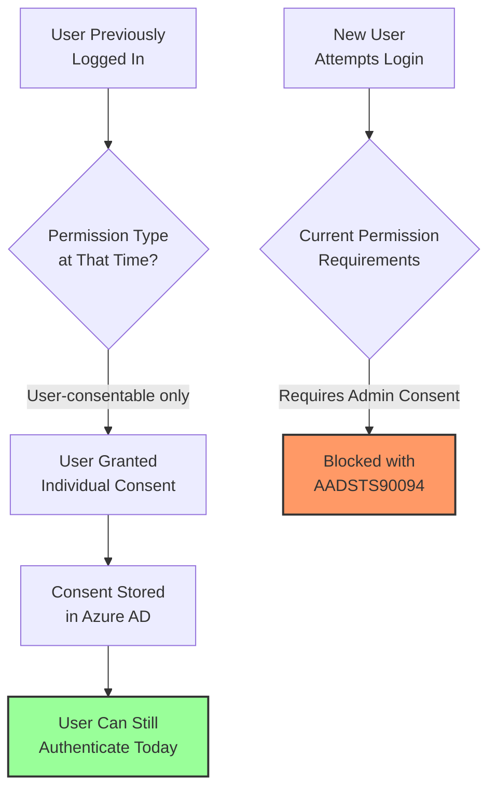

###### 2. Permission Evolution Timeline

| Time Period | Permissions Requested | Consent Type | User Impact |
|------------|----------------------|--------------|-------------|
| Initial Setup | `User.Read` only | User can self-consent | All users can login after individual consent |
| Permission Update | Added `Directory.Read.All` | Requires admin consent | Existing users continue, new users blocked |
| Current State | `User.Read` + other permissions | Mixed requirements | Grandfathered users work, new users need admin consent |

###### 3. Consent Persistence Rules

Azure AD maintains consent in three ways:

1. **Admin Consent** (Tenant-wide)
   - Applies to all users in the tenant
   - Survives permission changes
   - Must be explicitly revoked

2. **User Consent** (Individual)
   - Stored per user
   - Only for user-consentable permissions
   - Persists until revoked or app removed

3. **Delegated Permissions** (Inherited)
   - Users who consented when permissions were simpler
   - Continue to work with their original consent
   - New permission requirements don't retroactively block them

##### Current Authentication Matrix

| User Category | Can Authenticate? | Reason | Action Required |
|--------------|------------------|---------|-----------------|
| Previously consented users | ✅ Yes | Have individual consent stored | None |
| New users (first login) | ❌ No | Hit admin consent requirement | Admin must grant consent |
| Admin attempting first login | ❌ No | Admins can't self-bypass consent requirements | Must grant admin consent first, then login |
| Users after admin consent granted | ✅ Yes | Tenant-wide consent applies | None |
| Service accounts/Apps | ❌ No | Require admin consent for app permissions | Admin consent required |

##### How to Verify Who Has Consented

In Azure Portal:
```
Azure AD → Enterprise Applications → P2ES Auth0 Enterprise
→ Users and groups
   → Shows all users who have successfully consented
→ Sign-in logs
   → Filter by application name
   → Shows successful vs failed authentication attempts
```

##### Resolution Path

To enable all users (existing and new):

1. **Check Current Permissions**
   ```
   Azure AD → Enterprise Applications → P2ES Auth0 Enterprise
   → Permissions → View all permissions
   ```

2. **Grant Admin Consent**
   ```
   → Click "Grant admin consent for P2ES Holdings"
   → Confirm the permissions
   ```

3. **Alternative: Reduce Permissions**
   - Work with Auth0 to request only user-consentable permissions
   - Remove `Directory.Read.All` or other admin-only permissions
   - Allow users to self-consent

## Configuring Azure AD Permissions in Auth0

### Removing Directory.Read.All Permission

The `Directory.Read.All` permission is NOT requested by the Angular application itself, but rather configured in the Auth0 Enterprise Connection. The Angular app only requests `openid profile email`.

#### Where Permissions Are Configured

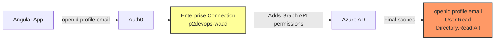

#### Option 1: Auth0 Dashboard Configuration

1. **Navigate to Enterprise Connection**
   ```
   Auth0 Dashboard → Authentication → Enterprise
   → Microsoft Azure AD → p2devops-waad
   → Settings Tab
   ```

2. **Modify API Permissions**
   - Find "Microsoft Graph API Permissions" or "Extended Attributes"
   - Uncheck or remove: `Directory.Read.All`
   - Keep only: `User.Read` for basic profile

3. **Update Attribute Mapping**
   ```
   Basic Profile: ✓ Enabled
   Extended Attributes: ✗ Disabled
   Groups: ✗ Disabled (this often requires Directory.Read.All)
   ```

#### Option 2: Auth0 Management API

```bash
# Get current connection configuration
curl -X GET "https://p2es-iam-dev.auth0.com/api/v2/connections/{connection_id}" \
  -H "Authorization: Bearer {MANAGEMENT_API_TOKEN}"

# Update connection to remove Directory.Read.All
curl -X PATCH "https://p2es-iam-dev.auth0.com/api/v2/connections/{connection_id}" \
  -H "Authorization: Bearer {MANAGEMENT_API_TOKEN}" \
  -H "Content-Type: application/json" \
  -d '{
    "options": {
      "client_id": "1f5da299-8302-4ea8-b88a-2e6e85011ef0",
      "client_secret": "{secret}",
      "domain": "p2es.com",
      "tenant_domain": "p2es.com",
      "scope": "openid profile email https://graph.microsoft.com/User.Read",
      "basic_profile": true,
      "ext_profile": false,
      "ext_groups": false
    }
  }'
```

#### Option 3: Terraform Configuration

If using Terraform to manage Auth0:

```hcl
resource "auth0_connection" "p2devops_waad" {
  name     = "p2devops-waad"
  strategy = "waad"
  
  options {
    client_id     = "1f5da299-8302-4ea8-b88a-2e6e85011ef0"
    client_secret = var.azure_ad_client_secret
    domain        = "p2es.com"
    tenant_domain = "p2es.com"
    
    # Only request User.Read, not Directory.Read.All
    scope = "openid profile email https://graph.microsoft.com/User.Read"
    
    # Disable extended attributes that require Directory.Read.All
    basic_profile = true
    ext_profile   = false
    ext_groups    = false  # Groups require Directory.Read.All
    
    # API permissions configuration
    api_enable_users = true
    use_wsfed        = false
    waad_protocol    = "openid-connect"
  }
}
```

### Impact of Removing Directory.Read.All

| Feature | With Directory.Read.All | Without Directory.Read.All |
|---------|-------------------------|----------------------------|
| Basic user profile | ✅ Available | ✅ Available |
| Email address | ✅ Available | ✅ Available |
| Display name | ✅ Available | ✅ Available |
| AD Groups | ✅ Available | ❌ Not available |
| Extended attributes | ✅ Available | ❌ Limited |
| Directory browsing | ✅ Available | ❌ Not available |
| Admin consent required | ✅ Yes | ❌ No (user can self-consent) |

### Testing After Configuration Change

1. **Clear Auth0 Cache**
   - Auth0 may cache connection settings
   - Wait 5-10 minutes after changes

2. **Test with New User**
   ```
   1. Use incognito/private browser
   2. Login with @p2es.com email
   3. Should NOT see admin consent error
   4. User can self-consent to User.Read
   ```

3. **Verify Scopes in Network Tab**
   - Check Azure AD authorize request
   - Should only see: `openid profile email https://graph.microsoft.com/User.Read`
   - Should NOT see: `Directory.Read.All`

## B2B Guest Authentication with Admin Consent

Analysis of B2B guest user authentication from `log_back_in_devops_ad_admin_approval.har` shows the admin consent flow for `jxc0116@p2es.com` authenticating to the p2devops.com tenant.

### Flow Diagram

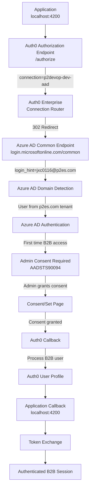

### Actual Authentication Steps (from HAR)

#### Step 1: Forced Connection Authentication
**Time:** 16:50:28  
**Endpoint:** `GET https://p2es-iam-dev.auth0.com/authorize`  
**Status:** 302 (Redirect)

Key parameters from HAR analysis:
```json
{
  "client_id": "wMJIjHdpGq4mchWPr9R6I9bHxHiCT0tB",
  "connection": "p2devop-dev-aad",
  "login_hint": "jxc0116@p2es.com",
  "domain_hint": "p2es.com",
  "scope": "openid profile email",
  "audience": "https://p2apis.p2devops.com",
  "redirect_uri": "http://localhost:4200"
}
```

#### Step 2: Azure AD Common Endpoint Redirect
**Time:** 16:50:29  
**Endpoint:** `GET https://login.microsoftonline.com/common/oauth2/v2.0/authorize`  
**Status:** 200 (OK)

Azure AD parameters from redirect:
```json
{
  "login_hint": "jxc0116@p2es.com",
  "response_type": "code",
  "client_id": "11d7cfba-abbe-4899-b5ef-a80c7386b4c1",
  "redirect_uri": "https://p2es-iam-dev.auth0.com/login/callback",
  "scope": "openid profile email",
  "state": "CwblOx4yb6uFYpjrcD3N6UBOZVSdsMqh"
}
```

#### Step 3: Admin Consent Flow
**Time:** 16:50:53  
**Endpoint:** `GET https://login.microsoftonline.com/common/Consent/Set`  
**Status:** Admin consent page displayed

**Critical Finding:** The B2B guest user from p2es.com requires admin consent to access the p2devops.com tenant application.

#### Step 4: Auth0 Consent Processing
**Time:** 16:51:01  
**Endpoint:** `GET https://p2es-iam-dev.auth0.com/u/consent`  
**Status:** Auth0 processes the consent response

### B2B Guest User Profile (Expected)
```json
{
  "given_name": "Jim",
  "family_name": "Chen",
  "name": "Jim Chen",
  "email": "jxc0116@p2es.com",
  "email_verified": true,
  "sub": "waad|[azure_ad_object_id_from_p2es_tenant]",
  "https://p2es.com/org": "p2es",
  "https://p2es.com/active": "true",
  "https://p2es.com/b2b_guest": "true",
  "https://p2es.com/host_tenant": "p2devops.com",
  "https://p2es.com/federated": "true"
}
```

### Key B2B Implementation Details

1. **Multi-Tenant Architecture**: Using `/common` endpoint allows users from any Azure AD tenant
2. **Admin Consent Required**: First-time access requires consent from p2devops.com tenant admin
3. **Cross-Tenant Identity**: User identity stays in p2es.com but gets access to p2devops.com resources
4. **Force Connection**: Application bypasses domain detection by specifying exact connection
5. **Login Hint**: Provides user email to Azure AD for faster authentication

## Multi-Tenant Support

### Azure AD Multi-Tenant Configuration

The enterprise connection is configured for multi-tenant B2B scenarios:

#### Common Endpoint Benefits
```
https://login.microsoftonline.com/common/oauth2/v2.0/authorize
```

- **Cross-Tenant Access**: Allows users from any Azure AD tenant to authenticate
- **Automatic Tenant Detection**: Azure AD determines user's home tenant from email
- **B2B Guest Support**: Enables external users to access resources after consent
- **Single Configuration**: One connection supports multiple source tenants

#### Admin Consent Process

1. **First Access**: User from external tenant (p2es.com) attempts login
2. **Consent Check**: Azure AD checks if app has consent in host tenant (p2devops.com)
3. **Admin Consent**: If not consented, redirects to admin consent page
4. **Permission Grant**: Admin grants permissions for external users
5. **User Access**: Subsequent logins work without additional consent

### Implementation Considerations

#### For Developers
- Use `login_hint` parameter to specify target user email
- Handle consent errors gracefully (AADSTS90094)
- Implement proper error messaging for users awaiting admin approval

#### For Administrators
- Pre-grant admin consent to avoid user friction
- Configure appropriate permissions (avoid Directory.Read.All if not needed)
- Monitor B2B guest user access and security

---

## Key Insights

### 1. Multiple Authentication Methods Supported

Auth0 is configured to support three distinct authentication methods:

| Method | Connection Type | User Identifier Format | Example User |
|--------|----------------|----------------------|--------------|
| Database | `P2DevOpsUsers` | `auth0\|[user_id]` | jim.oxy@oxy.com |
| Social (Google) | `google-oauth2` | `google-oauth2\|[google_id]` | cjsy2002@gmail.com |
| Enterprise | `p2devops-waad` | `waad\|[azure_ad_id]` | user@p2es.com |

### 2. Connection Selection Based on Domain

Auth0 routes users to different authentication methods based on:
1. **Email domain matching** - Enterprise connections have priority for matching domains
2. **User choice** - Social login buttons on login page
3. **Database fallback** - For users with stored credentials

### 3. Custom Claims Management

Different user types require different claim handling:

- **Database Users**: Claims manually added or via Auth0 Rules
- **Social Users**: Need claims added post-authentication via Rules/Actions
- **Enterprise Users**: Claims derived from AD groups and mapped automatically

### 4. Why Non-P2ES Domains Can Authenticate

Users with emails like `@oxy.com` or `@gmail.com` can access the system because:
1. They don't trigger the enterprise connection (domain mismatch)
2. They can use database or social authentication instead
3. Custom claims can be added to grant them appropriate access

### 5. Security Features Across All Methods

All authentication methods utilize:
- **PKCE Flow**: Code challenge/verifier for enhanced security
- **State Parameter**: CSRF attack prevention
- **Nonce**: Replay attack prevention
- **Secure Token Exchange**: OAuth 2.0 authorization code flow

---

## Configuration Analysis

### Available Connections Summary

| Connection Name | Type | Domain | Purpose | Authentication Method |
|----------------|------|---------|---------|---------------------|
| `p2devops-waad` | Azure AD | p2es.com | Production users | Federated (Azure AD) |
| `P2DevOpsUsers` | Database | Any | Test/Dev users | Username/Password |
| `google-oauth2` | Social | Any | External users | Google OAuth |

### Connection Selection Flow

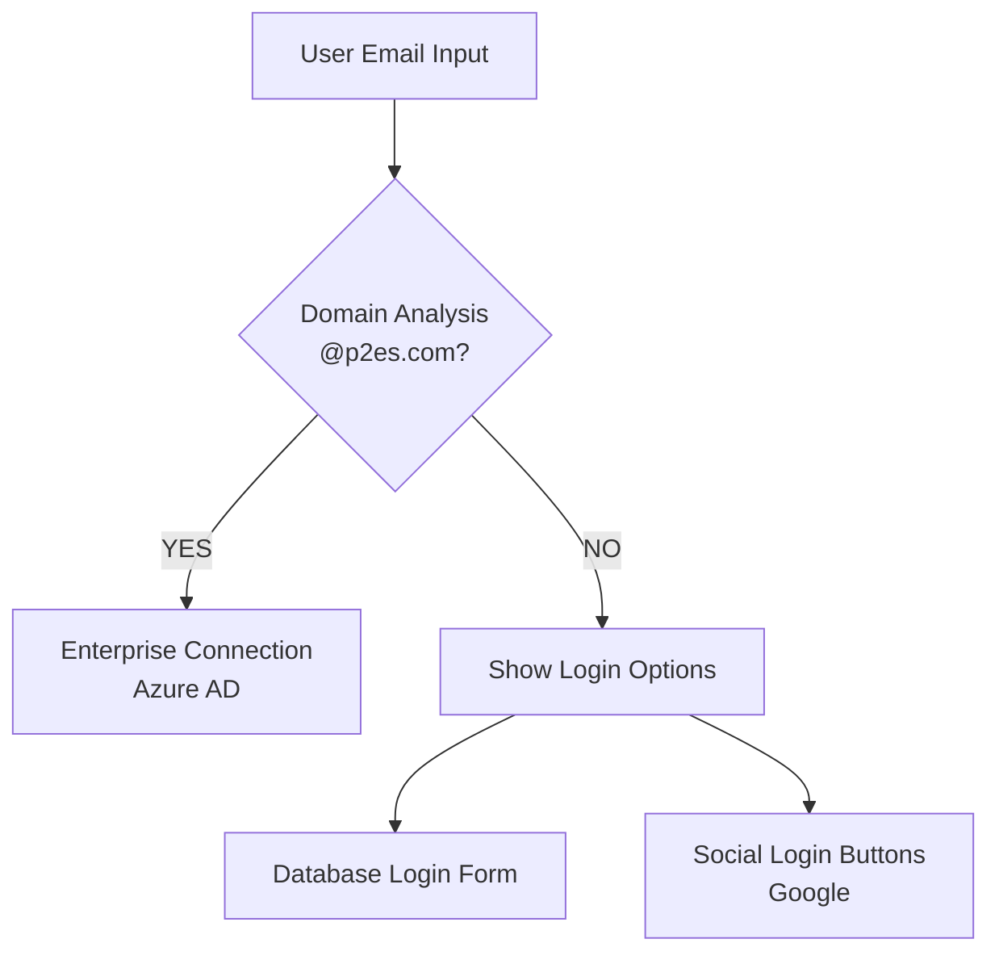

### Use Case Scenarios

#### 1. Production Enterprise User
- **Email**: `john.doe@p2es.com`
- **Route**: Automatic redirect to Azure AD
- **Claims**: Mapped from AD groups
- **Profile**: Includes federated flag and VD credentials

#### 2. Test/Development User
- **Email**: `jim.oxy@oxy.com`
- **Route**: Database authentication
- **Claims**: Manually configured
- **Profile**: Standard Auth0 database user

#### 3. External/Social User
- **Email**: `cjsy2002@gmail.com`
- **Route**: Google OAuth
- **Claims**: Must be added via Rules/Actions
- **Profile**: Google profile data

### Implementation Requirements

1. **Auth0 Rules/Actions** needed for:
   - Adding custom claims to social users
   - Mapping AD groups to P2 personas
   - Generating virtual desktop credentials

2. **Application handling** for:
   - Different user types (federated vs non-federated)
   - First-time federated user setup
   - Loading states during authentication

3. **Security considerations**:
   - Proper logout handling for federated users
   - Session management across different connection types
   - Token refresh for long-lived sessions

---

## Auth0 Actions - Post-Login Custom Claims Injection

Auth0 Actions are serverless functions that execute during specific points in the authentication flow. The `action-inject-persona-data.js` script runs after successful authentication for ALL connection types (database, social, and enterprise) to enrich tokens with P2-specific claims.

### Auth0 Actions Overview

#### Execution Context
- **Trigger Point**: Post-Login (after successful authentication, before token issuance)
- **Applies To**: All connection types (database, social, enterprise)
- **Runtime**: Node.js 18
- **Purpose**: Enrich ID and Access tokens with organization-specific permissions

### Event Object Structure and Data Sources

The `event` object contains comprehensive information about the authentication context. Here's where each attribute gets populated:

```javascript
event = {
  // Authentication Details
  connection: {
    id: "con_xxx",           // Connection identifier
    name: "P2DevOpsUsers",   // Connection name
    strategy: "auth0"        // "auth0", "google-oauth2", "waad", etc.
  },
  
  // User Information
  user: {
    email: "jim.oxy@oxy.com",
    email_verified: true,
    user_id: "auth0|5c892c1cebea722b368665bf",
    
    // Metadata containers
    user_metadata: {
      org: "p2es"           // User-editable metadata
    },
    app_metadata: {
      groups: ["Group1", "Group2"]  // System metadata
    },
    
    // For federated users
    groups: ["AD_Group_1", "AD_Group_2"]  // From Azure AD
  },
  
  // Transaction Context
  transaction: {
    requested_scopes: ["openid", "profile", "email", "offline_access"]
  },
  
  // Configuration
  secrets: {
    PERMISSION_SERVICE_URL: "https://api-test.p2devops.com/permission/v1",
    INTERNAL_API_SUBSCRIPTION_KEY: "xxx-xxx-xxx"
  },
  
  // Client Application
  client: {
    client_id: "wMJIjHdpGq4mchWPr9R6I9bHxHiCT0tB",
    name: "P2 Client Hub"
  }
}
```

### Event Object Attribute Population Sources

#### 1. Connection Attributes

| Attribute | Population Source | When Populated |
|-----------|------------------|----------------|
| `connection.id` | Auth0 Internal | When connection is created in Auth0 Dashboard |
| `connection.name` | Auth0 Dashboard → Authentication → Database/Social/Enterprise | During connection configuration |
| `connection.strategy` | Auth0 Internal | Based on connection type: `"auth0"` (database), `"google-oauth2"` (Google), `"waad"` (Azure AD) |

**Configuration Locations:**
- **Database**: Auth0 Dashboard → Authentication → Database → Create/Edit Connection
- **Social**: Auth0 Dashboard → Authentication → Social → Enable Provider
- **Enterprise**: Auth0 Dashboard → Authentication → Enterprise → Configure Azure AD

#### 2. User Core Attributes

| Attribute | Population Source | When Populated |
|-----------|------------------|----------------|
| `user.email` | **Database**: User registration or Auth0 Dashboard<br>**Social**: From provider (Google/Facebook)<br>**Enterprise**: From Azure AD | During authentication |
| `user.email_verified` | **Database**: Email verification flow or manual setting<br>**Social**: Usually `true` from provider<br>**Enterprise**: From AD attribute | Post-registration or from provider |
| `user.user_id` | Auth0 Internal | Generated on user creation with format:<br>`auth0\|{id}` (database)<br>`google-oauth2\|{id}` (Google)<br>`waad\|{id}` (Azure AD) |
| `user.given_name` | **Database**: User profile or registration<br>**Social**: From provider profile<br>**Enterprise**: AD `givenName` attribute | During profile sync |
| `user.family_name` | **Database**: User profile or registration<br>**Social**: From provider profile<br>**Enterprise**: AD `surname` attribute | During profile sync |

#### 3. User Metadata Attributes

| Attribute | Population Source | When Populated | How to Set |
|-----------|------------------|----------------|------------|
| `user.user_metadata` | Auth0 Management API or Dashboard | Anytime (user-editable) | **Dashboard**: User Management → Select User → User Metadata<br>**API**: `PATCH /api/v2/users/{id}`<br>**Example**: `{"org": "p2es"}` |
| `user.app_metadata` | Auth0 Management API or Dashboard | Anytime (admin only) | **Dashboard**: User Management → Select User → App Metadata<br>**API**: `PATCH /api/v2/users/{id}`<br>**Example**: `{"groups": ["Group1", "Group2"]}` |
| `user.groups` | **Enterprise Only**: Azure AD groups<br>Mapped from AD `memberOf` attribute | During federated authentication | Automatic from AD token claims |

**Setting Metadata via Management API:**
```javascript
// Update user_metadata
await management.updateUser({ id: userId }, {
  user_metadata: { org: "p2es" }
});

// Update app_metadata  
await management.updateUser({ id: userId }, {
  app_metadata: { groups: ["Group1", "Group2"] }
});
```

#### 4. Transaction Attributes

| Attribute | Population Source | When Populated |
|-----------|------------------|----------------|
| `transaction.requested_scopes` | Initial authorization request from application | From `/authorize` endpoint query parameters |
| `transaction.redirect_uri` | Application's authorization request | From `redirect_uri` parameter |
| `transaction.response_type` | Application's authorization request | From `response_type` parameter (usually `"code"`) |
| `transaction.state` | Application's authorization request | From `state` parameter for CSRF protection |

**Source in Application Code:**
```javascript
// Angular Auth0 SDK example
auth0.loginWithRedirect({
  scope: "openid profile email offline_access",  // → transaction.requested_scopes
  redirect_uri: "http://localhost:4200",          // → transaction.redirect_uri
  audience: "https://p2apis.p2devops.com"
});
```

#### 5. Secrets Attributes

| Attribute | Population Source | When Populated | Configuration Location |
|-----------|------------------|----------------|----------------------|
| `secrets.*` | Auth0 Action configuration | During Action deployment | Terraform or Auth0 Dashboard |

**Terraform Configuration (from main.auth0-actions.tf):**
```hcl
resource "auth0_action" "inject_persona_data" {
  secrets {
    name  = "PERMISSION_SERVICE_URL"
    value = data.terraform_remote_state.permission_service.outputs.api_management_route["route_v1"]
  }
  secrets {
    name  = "INTERNAL_API_SUBSCRIPTION_KEY"
    value = azurerm_api_management_subscription.client_hub_user.primary_key
  }
}
```

**Manual Configuration:**
- Auth0 Dashboard → Actions → Library → Select Action → Secrets

#### 6. Client Attributes

| Attribute | Population Source | When Populated | Configuration Location |
|-----------|------------------|----------------|----------------------|
| `client.client_id` | Auth0 Application configuration | When application is created | Auth0 Dashboard → Applications → Create Application |
| `client.name` | Application settings | During application setup | Auth0 Dashboard → Applications → Settings → Name |
| `client.metadata` | Application metadata | Optional configuration | Auth0 Dashboard → Applications → Settings → Advanced → Application Metadata |

### Special Population Scenarios

#### For Database Users (like jim.oxy@oxy.com):
```javascript
event.user = {
  email: "jim.oxy@oxy.com",              // From registration form
  user_id: "auth0|5c892c1cebea722b368665bf", // Auth0 generated
  user_metadata: { org: "p2es" },        // Set via Dashboard/API
  app_metadata: { 
    groups: ["afe-std-test", "reporting-std-test"] // Set via Dashboard/API
  }
  // No user.groups (only for federated users)
}
```

#### For Social Users (Google OAuth):
```javascript
event.user = {
  email: "cjsy2002@gmail.com",           // From Google profile
  user_id: "google-oauth2|100215936904259774771", // Google ID
  given_name: "Jerry",                   // From Google profile
  family_name: "Chen",                   // From Google profile
  picture: "https://lh3.google...",      // From Google profile
  // Metadata must be added via Rules/Actions post-authentication
}
```

#### For Enterprise Users (Azure AD):
```javascript
event.user = {
  email: "john.doe@p2es.com",            // From Azure AD
  user_id: "waad|AzureADObjectId",       // Azure AD Object ID
  groups: ["AD_Group_1", "AD_Group_2"],  // From Azure AD token
  // user_metadata and app_metadata can still be added in Auth0
}
```

### Data Flow Summary

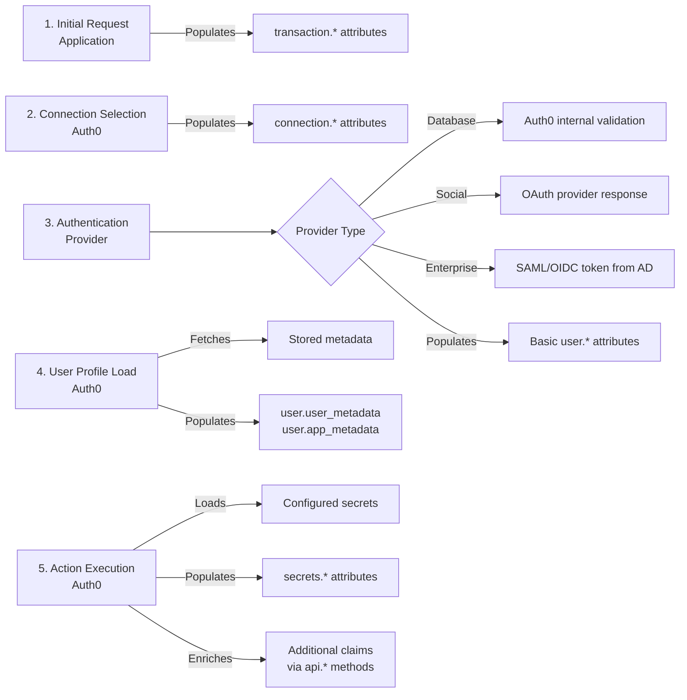

### API Object Structure

The `api` object provides methods to modify the authentication response:

```javascript
api = {
  // Access Token modifications
  accessToken: {
    addScope: (scope) => {},        // Add scope to access token
    setCustomClaim: (name, value) => {}  // Add custom claim
  },
  
  // ID Token modifications
  idToken: {
    setCustomClaim: (name, value) => {}  // Add custom claim to ID token
  },
  
  // Authentication control
  access: {
    deny: (reason) => {}  // Deny authentication with reason
  },
  
  // User modifications
  user: {
    setUserMetadata: (name, value) => {},
    setAppMetadata: (name, value) => {}
  }
}
```

### Script Analysis: action-inject-persona-data.js

#### Step 1: Connection Strategy Check (Lines 4-6)
```javascript
if (event.connection.strategy === "auth0") {
  return;  // Skip for database connections (handled differently)
}
```
**Note**: This seems counterintuitive but "auth0" strategy refers to Auth0's internal authentication, not database connections.

#### Step 2: Scope Management (Lines 11-34)
```javascript
// Reset scopes to prevent unauthorized access
var defaultScopes = ['openid', 'profile', 'email'];
var allowedAdditionalScopes = ['offline_access'];

// Filter and apply only allowed scopes
const scopes = defaultScopes.concat(allowedRequestedScopes);
scopes.forEach(scope => {
  if(scope && scope.trim()){
    api.accessToken.addScope(scope);
  }
});
```
**Purpose**: Prevents clients from requesting arbitrary scopes, enforcing security boundaries.

#### Step 3: Extract Organization and Groups (Lines 36-47)
```javascript
// Get organization from user metadata
var org = (event.user.user_metadata && event.user.user_metadata.org) 
  ? event.user.user_metadata.org : '';

// Get groups from multiple possible sources
var groups = [];
if (event.user.groups) {
  groups = event.user.groups;  // Federated users (Azure AD)
} else if (event.user.app_metadata && event.user.app_metadata.groups) {
  groups = event.user.app_metadata.groups;  // Database/Social users
}
```

**Group Sources by Connection Type**:
- **Enterprise (Azure AD)**: `event.user.groups` - From AD group memberships
- **Database/Social**: `event.user.app_metadata.groups` - Manually set in Auth0

#### Step 4: Fetch Entitlements from Permission Service (Lines 62-97)

```javascript
async function getEntitlements(userInfo, done) {
  // Build query with group IDs
  const query = userInfo.Groups.map(g => `groupIds=${g}`).join('&');
  const permissionServiceUrl = 
    `${event.secrets.PERMISSION_SERVICE_URL}/public/entitlements/organizations/${userInfo.Org}/personas?${query}`;

  // Call Permission Service API
  const response = await axios.get(permissionServiceUrl, {
    headers: {
      'Ocp-Apim-Subscription-Key': event.secrets.INTERNAL_API_SUBSCRIPTION_KEY,
      'Accept': 'application/json'
    },
    timeout: 15000
  });

  // Process entitlements
  entitlements.forEach(function (entitlement) {
    userInfo.Entitlements.push(`${entitlement.context}-${entitlement.sandbox}`);
  });
}
```

**API Call Flow**:
1. Constructs URL: `/public/entitlements/organizations/{org}/personas?groupIds={group1}&groupIds={group2}`
2. Uses Azure API Management subscription key for authentication
3. Maps personas to entitlement strings (e.g., "afe-std-test")

#### Step 5: Process and Add Claims (Lines 99-127)

```javascript
function processUserInfo(err, p2UserInfo) {
  const namespace = 'https://p2es.com/';
  
  // Add organization claim
  api.accessToken.setCustomClaim(namespace + 'org', p2UserInfo.Org);
  api.idToken.setCustomClaim(namespace + 'org', p2UserInfo.Org);
  
  // Add active status
  if (p2UserInfo.ActiveState === 'INACTIVE') {
    api.accessToken.setCustomClaim(namespace + 'active', 'false');
    api.idToken.setCustomClaim(namespace + 'active', 'false');
    return;  // Stop if user is inactive
  }
  
  // Add entitlements as space-separated string
  api.accessToken.setCustomClaim(namespace + 'grps', 
    p2UserInfo.Entitlements.join(' '));
  
  // Add federated flag
  api.accessToken.setCustomClaim(namespace + 'federated', 
    p2UserInfo.IsFederated);
}
```

**Custom Claims Added**:
- `https://p2es.com/org`: Organization identifier
- `https://p2es.com/active`: User active status
- `https://p2es.com/grps`: Space-separated entitlements
- `https://p2es.com/federated`: Whether user is federated

### Terraform Infrastructure Provisioning

#### 1. API Management Configuration (api-management-output.json)
```json
{
  "api_mgmt_dns_name": "api-test.p2devops.com",
  "api_mgmt_name": "test-api-904srx",
  "api_mgmt_group_internal_name": "internal"
}
```
Provides the API Management gateway for accessing backend services.

#### 2. Internal User Setup (main.internal-user.tf)
```hcl
resource "azurerm_api_management_user" "client_hub_user" {
  user_id = "clienthub"
  email   = "client.hub@p2energysolutions.com"
  # Creates user for API Management authentication
}

resource "azurerm_api_management_subscription" "client_hub_user" {
  user_id    = azurerm_api_management_user.client_hub_user.id
  product_id = data.terraform_remote_state.api_management.outputs.api_mgmt_product_internal_id
  # Generates subscription key for API access
}
```
Creates a service account with API subscription key for Auth0 to call backend services.

#### 3. Auth0 Action Deployment (main.auth0-actions.tf)
```hcl
resource "auth0_action" "inject_persona_data" {
  name    = "inject-persona-data"
  code    = file("${path.module}/assets/auth0/action-inject-persona-data.js")
  deploy  = true
  runtime = "node18"
  
  supported_triggers {
    id      = "post-login"
    version = "v3"
  }
  
  dependencies {
    name    = "axios"
    version = "latest"
  }
  
  secrets {
    name  = "PERMISSION_SERVICE_URL"
    value = data.terraform_remote_state.permission_service.outputs.api_management_route["route_v1"]
  }
  
  secrets {
    name  = "INTERNAL_API_SUBSCRIPTION_KEY"
    value = azurerm_api_management_subscription.client_hub_user.primary_key
  }
}

resource "auth0_trigger_action" "inject_persona_data" {
  trigger      = "post-login"
  action_id    = auth0_action.inject_persona_data.id
  display_name = auth0_action.inject_persona_data.name
}
```

### Complete Authentication Flow with Actions

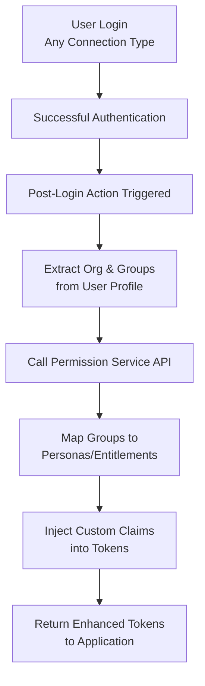

### Key Implementation Details

1. **Universal Application**: Works for all connection types by checking different metadata sources
2. **Security Enforcement**: Restricts scope requests to prevent privilege escalation
3. **External Service Integration**: Calls Permission Service for dynamic entitlement resolution
4. **Namespace Usage**: Claims use `https://p2es.com/` namespace to avoid conflicts
5. **Error Handling**: Gracefully handles missing org/groups without breaking authentication
6. **Performance**: 15-second timeout on API calls to prevent hanging authentications

### Troubleshooting Guide

| Issue | Cause | Solution |
|-------|-------|----------|
| No custom claims in token | Missing org or groups | Add user_metadata.org and app_metadata.groups in Auth0 dashboard |
| Permission Service timeout | Network/service issue | Check API Management logs and service health |
| Invalid entitlements | Group mapping issue | Verify group IDs exist in Permission Service |
| Claims for social users missing | No metadata set | Configure Auth0 Rule to add metadata for social users |

---

## Conclusion

The comprehensive analysis of authentication flows reveals Auth0's flexible architecture supporting multiple authentication methods:

1. **Database Authentication** (`P2DevOpsUsers`) - For test users and development scenarios
2. **Social Authentication** (`google-oauth2`) - For external users without enterprise accounts
3. **Enterprise Federation** (`p2devops-waad`) - For production users with corporate Azure AD accounts

### Key Takeaways

- **Domain-based routing** automatically directs users to appropriate authentication methods
- **Custom claims** provide consistent authorization across all user types
- **PKCE flow** ensures security across all authentication methods
- **Flexible configuration** allows mixing authentication methods in the same tenant

### Implementation Recommendations

1. **Configure Auth0 Rules/Actions** to:
   - Add P2 organization claims to social users
   - Map Azure AD groups to P2 personas for enterprise users
   - Generate virtual desktop credentials for federated users

2. **Update application to handle**:
   - Different authentication flows based on user type
   - Loading states during first-time federated login
   - Proper logout for federated sessions

3. **Test all authentication paths**:
   - Database users with custom claims
   - Social users requiring claim enrichment
   - Enterprise users with AD group mapping

This multi-authentication approach enables the P2 platform to support various user types while maintaining a consistent security and authorization model across the entire system.